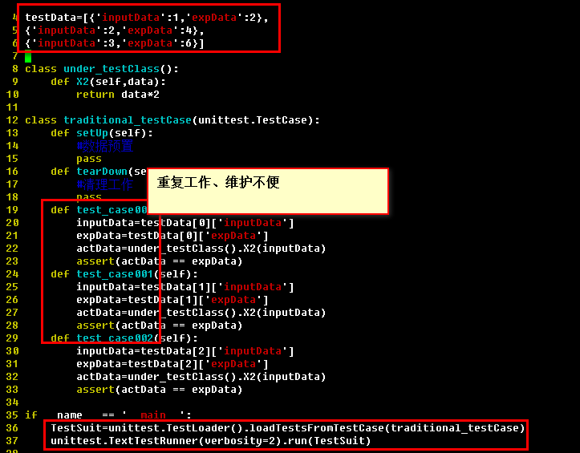
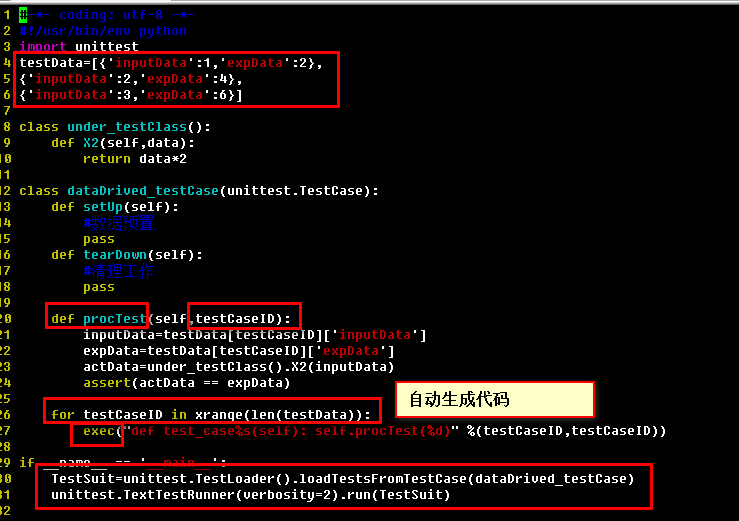

dataDrivedPythonUnittestFramework
================================

### Introduction:
an extraordinary pratical framework of python unittest for data-drived test.

### Feature:
* a universal unittest framework escepially for data-drived test.
* code generated automatically,aim to reduce the workload and the costs of script maintenance.
* extra test runner is not needed yet.

### Usage:
* traditionalFramework like this:      
    

* dataDrivedFramework like this:      

* result ot the test:      

